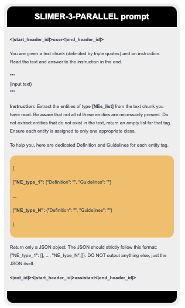

<div align="center">
  <h1>👻 SLIMER-PARALLEL: Show Less Instruct More Entity Recognition</h1>
</div>

<p align="center">
    <a href="https://github.com/andrewzamai/SLIMER/blob/main/LICENSE"></a>
    <a href="https://huggingface.co/expertai/SLIMER"></a>
    <a href="https://arxiv.org/abs/2407.01272"></a>
    <a href="https://www.expert.ai/"></a>
</p>

## Instruct your LLM with Definitions and Guidelines for Zero-Shot NER 🔎 📖

This LLaMA-3 based SLIMER scores +17 % over paper's original SLIMER LLaMA-2,
while allowing up to 16 NEs to be extracted in parallel per prompt. 

Designed to work on:

&nbsp;&nbsp;&nbsp;&nbsp;✅ Out-Of-Domain inputs (e.g. news, science, politics, music ...)

&nbsp;&nbsp;&nbsp;&nbsp;✅ Never-Seen-Before Named Entities (the model was not trained on that entity type? It will tag it anyway!)

&nbsp;&nbsp;&nbsp;&nbsp;✅ Parallel NE types extraction

<div align="center">

</div>

## 📄 TL;DR
Existing models primarily focus on addressing zero-shot NER on Out-of-Domain inputs, while fine-tuning on an extensive number of entity classes that often highly or completely overlap with the test sets used in the literature. 

But what happens in everyday use when they encounter entities that were not included in training? 
As demonstrated on BUSTER, they are likely to significantly underperform 📉, revealing a critical weakness in handling never-seen-before entity types. 🆘

In this work, we propose SLIMER, an approach designed to tackle never-seen-before entity tags by instructing the model on fewer examples from a reduced tag set, and by leveraging a prompt enriched with definition and guidelines.

Experiments demonstrate that definition and guidelines yield to faster, more robust learning, and better performance, particularly when labelling unseen named entities. 

When compared to other existing solutions under similar training conditions, SLIMER demonstrates superior capability in handling unseen entities, delivering more robust performance in real-world applications. 🏆

PROs:

&nbsp;&nbsp;&nbsp;&nbsp;✅ guide your LLM with external knowledge about the NE to tag 
&nbsp;&nbsp;&nbsp;&nbsp;✅ definition and guidelines simple syntax (no code)

&nbsp;&nbsp;&nbsp;&nbsp;✅ flexibility to different annotation schemes 
&nbsp;&nbsp;&nbsp;&nbsp;✅ granularity and exceptions (all people not musicians)

&nbsp;&nbsp;&nbsp;&nbsp;✅ disambiguate on polysemous NEs
&nbsp;&nbsp;&nbsp;&nbsp;✅ nested-NER (one span of text, multiple categories)

&nbsp;&nbsp;&nbsp;&nbsp;✅ long documents handling

CONs:

&nbsp;&nbsp;&nbsp;&nbsp;✅ this version does now scale well with increasing label set cardinality


## Installation

You will need to install the following dependencies to run SLIMER:
```
pip install --upgrade pip
pip install -r ./requirements.txt
```

## Running

Evaluate SLIMER w/ D&G on MIT/CrossNER/BUSTER
```
PYTHONPATH=$(pwd) python src/SFT_finetuning/evaluating/evaluate_SLIMER_PARALLEL.py expertai/SLIMER -1 --with_guidelines
```

Train, merge, evaluate your SLIMER:
```
# 1) train on PileNER-subset with Definition and Guidelines, 391 NEs
PYTHONPATH=$(pwd) python src/SFT_finetuning/training/finetune_sft_SLIMER_PARALLEL.py

# 2) merge LORA weights

# 3) evaluate SLIMER model on MIT/CrossNER/BUSTER
```

## Run it on your NER data!

Running SLIMER on your data is simple as:

1) implement *load_datasetdict_BIO()* (tell where and how to load your NER data), *get_map_to_extended_NE_name()* (e.g. PER-->PERSON) of **Data_Interface** abstract class
   
2) provide your Definition and Guidelines for each NE class
   
3) run SLIMER!

## Demo usage

A simple inference example is as follows:

```python
from vllm import LLM, SamplingParams

vllm_model = LLM(model="expertai/SLIMER-PARALLEL-LLaMA3")
tokenizer = vllm_model.get_tokenizer()

# suggested temperature 0, max_tokens hyperparam
cutoff_len = 4096
sampling_params = SamplingParams(temperature=0, max_tokens=1000, stop=tokenizer.eos_token)

# given list of NE types and dictionary of Def and Guidelines for each --> returns instruction
slimer_prompter = SLIMER_PARALLEL_instruction_prompter("SLIMER_PARALLEL_instruction_template", './src/SFT_finetuning/templates')

# create a dictionary of dictionaries, each NE_type as key should have a {Definition: str, Guidelines: str} value
ne_types_list = ['ORGANIZATION', 'UNIVERSITY', 'LOCATION', 'PERSON', 'CONFERENCE']
def_guidelines_per_NE_dict = {'ORGANIZATION': {'Definition': "'organization' refers to structured groups, institutions, companies, or associations.", 'Guidelines': "Avoid labeling generic terms like 'team' or 'group'. Exercise caution with ambiguous entities like 'Apple' (company vs. fruit) and 'Manchester United' (sports team vs. fan club)."}, 'UNIVERSITY': {'Definition': 'UNIVERSITY represents educational institutions that offer higher education and academic research programs.', 'Guidelines': "Avoid labeling general concepts such as 'education' or 'academia' as UNIVERSITY. Exercise caution with ambiguous terms like 'Cambridge' (can refer to different institutions) and 'Harvard' (can refer to a person)."}, 'LOCATION': {'Definition': 'LOCATION refers to specific geographic entities such as venues, facilities, and institutions that represent physical places with distinct addresses or functions.', 'Guidelines': "Exercise caution with ambiguous terms, e.g., 'Amazon' (company, river, and region) and 'Cambridge' (U.S. city, UK city, and university). Consider the context and specificity to accurately classify locations."}, 'PERSON': {'Definition': 'PERSON refers to individuals, including public figures, celebrities, and notable personalities.', 'Guidelines': 'If a person is working on research (including professor, Ph.D. student, researcher in companies, and etc) avoid labeling it as PERSON entity.'}, 'CONFERENCE': {'Definition': 'CONFERENCE refers to specific events or gatherings where experts, researchers, and professionals convene to present and discuss their work in a particular field or discipline.', 'Guidelines': "Exercise caution when labeling entities that could refer to institutions, organizations, or associations rather than specific events. Take care with ambiguous terms like 'International Journal of Computer Vision', which may refer to a publication rather than a conference."}}

instruction = slimer_prompter.generate_prompt(
  ne_tags=", ".join(ne_types_list),
  def_and_guidelines=json.dumps(def_guidelines_per_NE_dict, indent=2),
  expected_json_format=json.dumps({k: [] for k in def_guidelines_per_NE_dict.keys()}, indent=2)
)

input_text = 'Typical generative model approaches include naive Bayes classifier s , Gaussian mixture model s , variational autoencoders and others .'

# this promper formats the input text to analize with SLIMER instruction
input_instruction_prompter = Prompter('LLaMA3-chat-NOheaders', template_path='./src/SFT_finetuning/templates')

system_message = "You are a helpful NER assistant designed to output JSON."
conversation = [
    {"role": "system", "content": system_message},
    {"role": "user", "content": input_instruction_prompter.generate_prompt(input=input_text, instruction=instruction)},  # the input_text + instruction
]
prompt = tokenizer.apply_chat_template(conversation, tokenize=False, truncation=True, max_length=cutoff_len, add_generation_prompt=True)

responses = vllm_model.generate(prompt, sampling_params)
```
    
## 📚 Citation

If you find SLIMER useful in your work or research, please consider citing our paper:

```bibtex
@misc{zamai2024lessinstructmoreenriching,
      title={Show Less, Instruct More: Enriching Prompts with Definitions and Guidelines for Zero-Shot NER}, 
      author={Andrew Zamai and Andrea Zugarini and Leonardo Rigutini and Marco Ernandes and Marco Maggini},
      year={2024},
      eprint={2407.01272},
      archivePrefix={arXiv},
      primaryClass={cs.CL},
      url={https://arxiv.org/abs/2407.01272}, 
}
```
