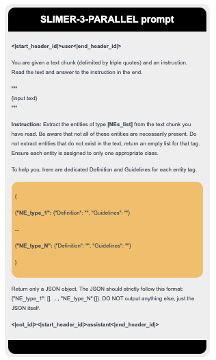

<div align="center">
  <h1>👻 SLIMER: Show Less Instruct More Entity Recognition</h1>
</div>


<p align="center">
    <a href="https://github.com/andrewzamai/SLIMER/blob/main/LICENSE"></a>
    <a href="https://huggingface.co/expertai/SLIMER"></a>
    <a href="https://arxiv.org/abs/2407.01272"></a>
    <a href="https://www.expert.ai/"></a>
</p>

## Instruct your LLM with Definitions and Guidelines for Zero-Shot NER 🔎 📖

Designed to work on:

&nbsp;&nbsp;&nbsp;&nbsp;✅ Out-Of-Domain inputs (e.g. news, science, politics, music ...)

&nbsp;&nbsp;&nbsp;&nbsp;✅ Never-Seen-Before Named Entities (the model was not trained on that tag? It will tag it anyway!)

<div align="center">

</div>


## 📄 TL;DR
Existing models primarily focus on addressing zero-shot NER on Out-of-Domain inputs, while fine-tuning on an extensive number of entity classes that often highly or completely overlap with the test sets used in the literature. 

But what happens in everyday use when they encounter entities that were not included in training? 
As demonstrated on BUSTER, they are likely to significantly underperform 📉, revealing a critical weakness in handling unseen entities. 🆘

In this work, we propose SLIMER, an approach designed to tackle never-seen-before entity tags by instructing the model on fewer examples, and by leveraging a prompt enriched with definition and guidelines.

Experiments demonstrate that definition and guidelines yield to faster, more robust learning, and better performance, particularly when labelling unseen named entities. 

When compared to other existing solutions under similar training conditions, SLIMER demonstrates superior capability in handling unseen entities, delivering more robust performance in real-world applications. 🏆

PROs:

&nbsp;&nbsp;&nbsp;&nbsp;✅ guide your LLM with external knowledge about the NE to tag 
&nbsp;&nbsp;&nbsp;&nbsp;✅ definition and guidelines simple syntax (no code)

&nbsp;&nbsp;&nbsp;&nbsp;✅ flexibility to different annotation schemes 
&nbsp;&nbsp;&nbsp;&nbsp;✅ granularity and exceptions (all people not musicians)

&nbsp;&nbsp;&nbsp;&nbsp;✅ disambiguate on polysemous NEs
&nbsp;&nbsp;&nbsp;&nbsp;✅ nested-NER (one span of text, multiple categories)

&nbsp;&nbsp;&nbsp;&nbsp;✅ long documents handling

CONs:

&nbsp;&nbsp;&nbsp;&nbsp;❌ does not scale well with increasing label set cardinality


## 📚 Citation

If you find SLIMER useful in your work or research, please consider citing our paper:

```bibtex
@misc{zamai2024lessinstructmoreenriching,
      title={Show Less, Instruct More: Enriching Prompts with Definitions and Guidelines for Zero-Shot NER}, 
      author={Andrew Zamai and Andrea Zugarini and Leonardo Rigutini and Marco Ernandes and Marco Maggini},
      year={2024},
      eprint={2407.01272},
      archivePrefix={arXiv},
      primaryClass={cs.CL},
      url={https://arxiv.org/abs/2407.01272}, 
}
```
